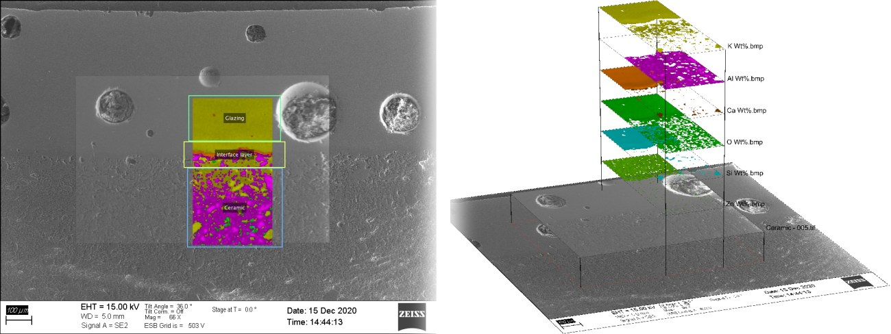

# Correlative Microscopy App

## Key features
- Image overlay
- Intuitive manual image alignment
- Image visualization
- Image enhancement
- Analysis

We are developing a software for overlaying and analyzing images, creating visualizations. The software is capable of processing generic image formats. It is specifically developed for correlative microscopy but can be used for many applications. Image alignment can be done easily and accurately by hand or by automatic tools, and further enhanced by various options. The software provides the user with creative ways of interacting with the data, and specific functionalities can be utilized to extract hidden information from the existing data.

The goal for the program is to be as accessible and versatile as possible, and not constrained by the type of the images. Industry standard software can often have a steep learning curve and high maintenance costs, and we aim to provide an intuitive and easy-to-use option that competes with existing programs. The project is work-in-progress, but it is already a useful tool in laboratory settings.

## Installing
<b>Windows </b>
On the Releases tab, select the latest version of the program. Inside there are four files, the Executable.zip, Full_Installer.zip and the source codes. Download the following:
- [Executable](https://github.com/viliamsalli/CorrelativeMicroscopyApp/releases/download/v1.0/Executable.zip): If you have MATLAB Runtime 2022b or 2023a installed, download the Executable.zip. The file contains the executable software and the documentation.
- <s>[Full Installer](https://github.com/viliamsalli/CorrelativeMicroscopyApp/releases/download/v1.0/Full_Installer.zip): If you don't have the Runtime installed or it is outdated, download the Full_Installer.zip. The file contains an installer, which downloads the correct MATLAB Runtime and sets up the software executable. </s>   This installer downloads the MATLAB Runtime from internet, and is therefore falsely labeled as a virus (https://se.mathworks.com/matlabcentral/answers/1930760-installation-file-detected-as-a-trojan).
- If you don't have the Runtime installed or it is outdated, download it from [MATLAB's website](https://se.mathworks.com/products/compiler/matlab-runtime.html). After this, download the [Executable.zip](https://github.com/viliamsalli/CorrelativeMicroscopyApp/releases/download/v1.0/Executable.zip), which contains the software, and the documentation.

[Go to Releases](../../releases)
